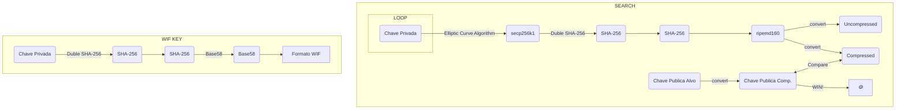

<h1 align="center">BitHunter</h1>

## Funcionalidades

- **Puzzle Wallets**: Descubra chaves privadas.
	- Puzzle wallets
- **Conversão de Chaves**:
	- Converta chaves privadas em formato Wallet Import Format (WIF).
	- Converta chaves privadas em chaves públicas.
	- Converta chaves públicas em endereços Bitcoin.

<br/>

## Diagrama



---

## How to Use

### Build and Run the Project

1. Open a terminal and navigate to your project folder.

2. To compile and run the project, execute the following command:

### Build and Run

```bash
   ./build.bat
```

### Build and Package
  ```bash
   ./buildPackage.bat
  ```


## Contribuição
Contribuições são bem-vindas! Se você deseja ajudar a melhorar o projeto, sinta-se à vontade para abrir issues ou pull requests.
