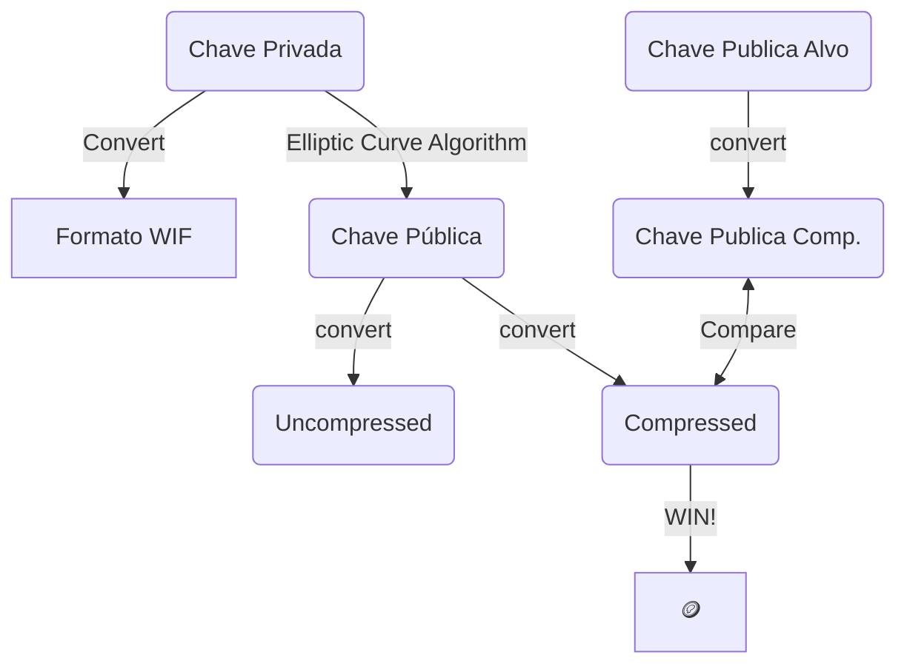

# BitHunter

<p>Esta é uma aplicação desenvolvida para fornecer uma variedade de ferramentas úteis para a comunidade de crypto e para entusiastas da computação. Ela oferece uma gama de ferramentas de conversão e funcionalidades que ajudam a simplificar tarefas complexas.</p>
<br/>

---
## Funcionamento



---

## Funcionalidades

- **Puzzle Wallets**: Descubra a chaves privadas ocultas nessas wallets misteriosas.
- **Conversão de Chaves**:
	- Converta chaves privadas em formato Wallet Import Format (WIF).
	- Converta chaves privadas em chaves públicas.
	- Converta chaves públicas em endereços Bitcoin.
- **Conversões**:
	- String para binário.
	- String para hexadecimal.
	- Hexadecimal para binário.
	- Entre outros.
	
---

## How to Use

### Build and Run the Project

1. Open a terminal and navigate to your project folder.

2. To compile and run the project, execute the following command:

### Build and Run

```bash
   ./build.bat
```

### Build and Package
  ```bash
   ./buildPackage.bat
  ```


## Contribuição
Contribuições são bem-vindas! Se você deseja ajudar a melhorar o projeto, sinta-se à vontade para abrir issues ou pull requests.
