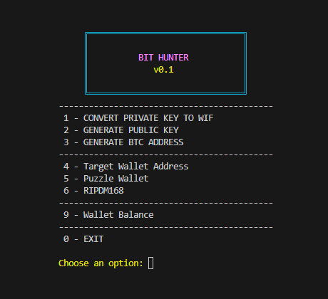
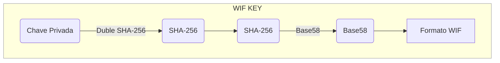

<h1 align="center">BitHunter</h1>

<p align="center">
  
</p>

## Funcionalidades

- **Puzzle Wallets**: Descubra chaves privadas.
	- Puzzle wallets
- **Conversão de Chaves**:
	- Converta chaves privadas em formato Wallet Import Format (WIF).
	- Converta chaves privadas em chaves públicas.
	- Converta chaves públicas em endereços Bitcoin.

<br/>

## Diagram

```mermaid
flowchart TD
	subgraph SEARCH[SEARCH]
	style SEARCH stroke:#A9A9A9,troke-width:4px
		subgraph LOOP[LOOP]
			PrivateKey2(Chave Privada)
		end
		PrivateKey2 -->|Elliptic Curve Algorithm| CurvaEliptica(secp256k1)
		CurvaEliptica -->|Duble SHA-256| SHA-256-1(SHA-256)
		SHA-256-1 --> SHA-256-2(SHA-256)
		SHA-256-2 --> ripemd160(ripemd160)

		ripemd160 --> |convert| uncompressed(Uncompressed)
		ripemd160 --> |convert| compressed(Compressed)
		
		PublicKeyTarget(Chave Publica Alvo) --> |convert| compressed2(Compressed)
		compressed2(Chave Publica Comp.) <--> |Compare| compressed
		compressed --> AddressGenerated(Address)
		AddressTarget(Target Address) <--> |Compare| AddressGenerated

		AddressGenerated -.-> |WIN!| Value
		compressed2 -.-> |WIN!| Value[🪙]
	end
```





---

## How to Use

### Build and Run the Project

1. Open a terminal and navigate to your project folder.

2. To compile and run the project, execute the following command:

### Build and Run

```bash
   ./build.bat
```

### Build and Package
  ```bash
   ./buildPackage.bat
  ```


## Contribuição
Contribuições são bem-vindas! Se você deseja ajudar a melhorar o projeto, sinta-se à vontade para abrir issues ou pull requests.
